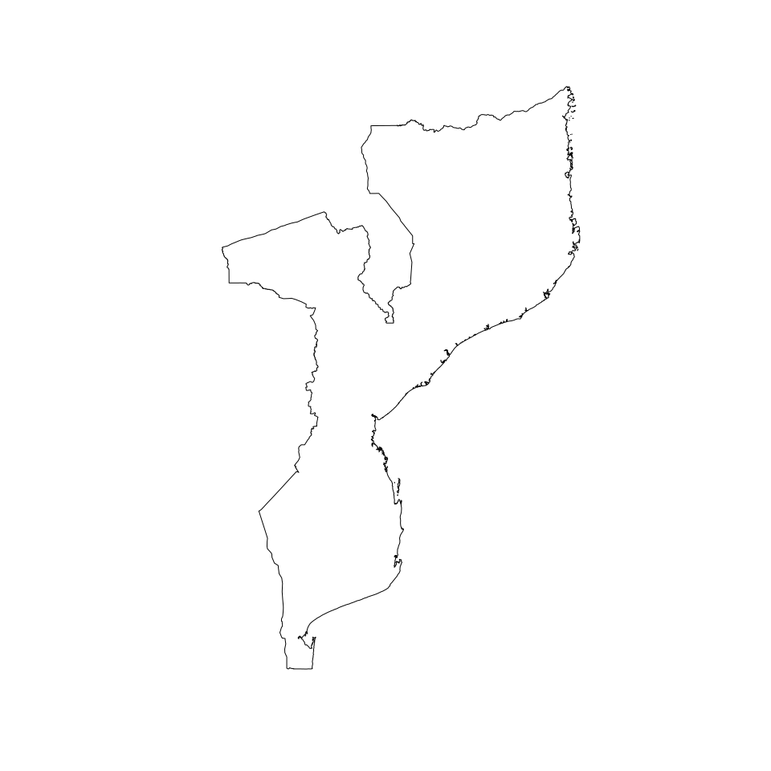

<!-- README.md is generated from README.Rmd. Please edit that file -->

# mozambique: Datasets for Designing Surveys in Mozambique 

<!-- badges: start -->

[](https://www.repostatus.org/#active)
[](https://www.tidyverse.org/lifecycle/#experimental)
[](https://github.com/spatialworks/mozambique/actions?query=workflow%3AR-CMD-check)
[](https://app.codecov.io/gh/spatialworks/mozambique?branch=master)
[](https://www.codefactor.io/repository/github/spatialworks/mozambique)
<!-- badges: end -->

Designing surveys require relevant datasets to be used as basis for
sample size calculations, sampling design, survey planning/logistics and
survey implementation. These include datasets on population, lists of
sampling clusters, map datasets for spatial sampling, and previous
survey datasets that can be used for estimating indicator variance and
design effects. This package contains relevant datasets for use in
designing surveys in Mozambique.

## Installation

You can install the development version from
[GitHub](https://github.com/spatialworks/mozambique) with:

## Usage

### Country borders

``` r
library(mozambique)

## Retrieve country borders
country <- get_country()
#> Reading layer `moz_admbnda_adm0_ine_20190607' from data source `/tmp/RtmpIUiort' using driver `ESRI Shapefile'
#> Simple feature collection with 1 feature and 13 fields
#> Geometry type: MULTIPOLYGON
#> Dimension:     XY
#> Bounding box:  xmin: 30.21173 ymin: -26.86704 xmax: 40.84041 ymax: -10.47367
#> Geodetic CRS:  WGS 84

## Plot country borders
plot(sf::st_geometry(country))
```



### Provincias borders

``` r
## Retrieve provincias borders
provincias <- get_provinces()
#> Reading layer `moz_admbnda_adm1_ine_20190607' from data source `/tmp/RtmpIUiort' using driver `ESRI Shapefile'
#> Simple feature collection with 11 features and 13 fields
#> Geometry type: MULTIPOLYGON
#> Dimension:     XY
#> Bounding box:  xmin: 30.21173 ymin: -26.86704 xmax: 40.84041 ymax: -10.47367
#> Geodetic CRS:  WGS 84

## Plot provincias borders
plot(sf::st_geometry(provincias))
```


### Distritos borders

``` r
## Retrieve distritos borders
distritos <- get_districts()
#> Reading layer `moz_admbnda_adm2_ine_20190607' from data source `/tmp/RtmpIUiort' using driver `ESRI Shapefile'
#> Simple feature collection with 159 features and 15 fields
#> Geometry type: MULTIPOLYGON
#> Dimension:     XY
#> Bounding box:  xmin: 30.21173 ymin: -26.86704 xmax: 40.84041 ymax: -10.47367
#> Geodetic CRS:  WGS 84

## Plot distritos borders
plot(sf::st_geometry(distritos))
```


### Postos borders

``` r
## Retrieve postos borders
postos <- get_posts()
#> Reading layer `moz_admbnda_adm3_ine_20190607' from data source `/tmp/RtmpIUiort' using driver `ESRI Shapefile'
#> Simple feature collection with 411 features and 17 fields
#> Geometry type: MULTIPOLYGON
#> Dimension:     XY
#> Bounding box:  xmin: 30.21173 ymin: -26.86704 xmax: 40.84041 ymax: -10.47367
#> Geodetic CRS:  WGS 84

## Plot postos borders
plot(sf::st_geometry(postos))
```


### Settlements

``` r
plot(sf::st_geometry(provincias))
plot(sf::st_geometry(settlements), pch = 16, cex = 0.2, col = "blue", add = TRUE)
```


